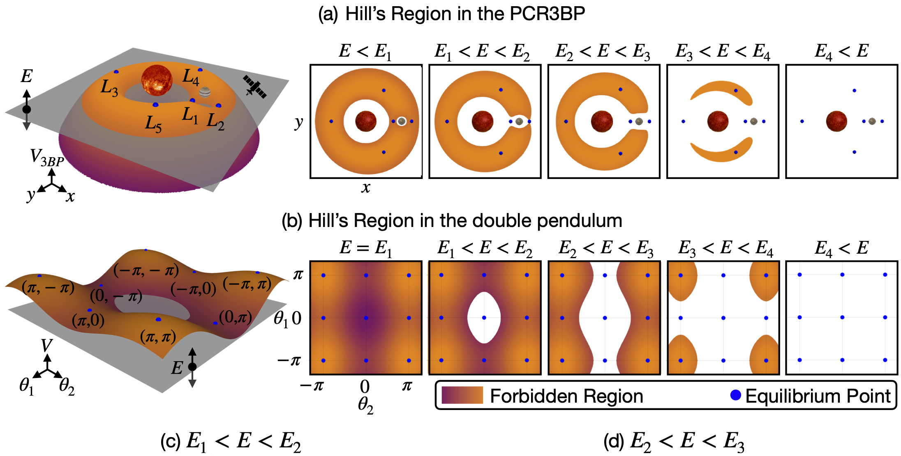

# This repository contains the file needed for paper *"[Saddle Transport and Chaos in the Double Pendulum]()"* by Kaheman and Bramburger et al. 

## Note: Both Kadierdan Kaheman and Jason J. Bramburger contributed equally to this paper, and they share the first authorship.

## Overview:
Pendulums are simple mechanical systems that have been studied for centuries and showcase almost every aspect of modern dynamical systems theory. In particular, the double pendulum is a prototypical example of a chaotic system that is easily visualized and so is used to convey the most basic characteristics of complex dynamics. However, little reseach has been done on studying its global pathways, termed tubes, that enable macroscopic transport over vast regions of phase space. Motivated in part by similar studies on the three body problem, we are able to draw a direct comparison between the dynamics of the double pendulum and interstellar transport which exist on vastly different scales. We demonstrate that the double pendulum is a perfect analog system of the three-body problem, as following two figures show. Thus, the double pendulum comes as an excellent table-top testing ground for space mission design that seeks to exploit the gravitationally determined pathways known to exist in multi-body systems. The results of this manuscript detail is a variety of acrobatic motions for the double pendulum in physical space that can be identified and controlled to entrain its motion. For more details, pelase check out our paper *"[Saddle Transport and Chaos in the Double Pendulum]()"*.

 Despite representing dynamics on vastly different scales, the planar restricted 3-body problem (PCR3BP) and the double pendulum bear a striking resemblance. The Lagrange points L1 and L2 in the PCR3BP are analogous to the saddle Down-Up and Up-Down states since they all have one-dimensional stable and unstable directions and a two-dimensional center direction. 

 Hill’s region comparison of PCR3BP and double pendulum. The energy values Ei are meant to denote the transitions in which the Hill’s region is extended to include another critical point of the energy surface. 

## This repository contains the following folders:
- Images: This folder contains the figures that demonstrate the resemblance between the double pendulum and PCR3BP.
- Down-Up Periodic Orbit Visualization: This folder contains files that visualize the Down-Up periodic orbit shown in Fig.6 of our paper. It is used to calculate the Down-Up stable and unstable manifolds of double pendulum.
- Up-Down Periodic Orbit Visualization: This folder contains files that visualize the Up-Down periodic orbit shown in Fig.6 of our paper. It is used to calculate the Up-Down stable and unstable manifolds of double pendulum.
- Down-Up 2Pi Periodic Orbit Visualization: This folder contains files that visualize the special Down-Up 2 Pi periodic orbit shown in Fig.9 of our paper.
- Up-Down 2Pi Periodic Orbit Visualization: This folder contains files that visualize the special Up-Down 2 Pi periodic orbit shown in Fig.11 of our paper. 
- Down-Up Saddle Homoclinic Orbits Visualization: This folder contains files that visualize the Down-Up homoclinic orbits of the double pendulum shown in Fig.8 of our paper.
- Up-Down Saddle Homoclinic Orbits Visualization: This folder contains files that visualize the Up-Down homoclinic orbits of the double pendulum shown in Fig.10 of our paper.
- Heteroclinic Orbit Transistion: This folder contains files that illustrate the motion of heteroclinic orbits shown in Fig.12 of our paper.
- Julia Codes: This folder contains Julia code we used to calculate the periodic, homoclinic, heteroclinic orbits of the double pendulum and PCR3BP.

## Notes on runing the Julia code:
- The version of Julia we used for this project is 1.6.5, with a computer that is equiped with AMD Ryzen 7 2700X Eight-core CPU and running Windows 10 OS.
- The best way to set up the project is by running command "Pkg.instantiate()" in the Julia terminal.
- All the packages needed for running the can be seen in "LoadPackages.jl".
- All the functions needed for PCR3BP can be seen in "TubeFunctionTBP.jl". All the functions needed for double pendulum can be seen in "TubeFunctionDP.jl".
- The plotting settings can be changed in "PlotSettings.jl".
- Be patient when the packages are loading, it will take a while. 
- Be patient when plotting the figure for the first time, it will take a while. This is called *"time to first plot"* problem in Julia.
- For other details, pelase check the "Instruction.md" files located in "Julia Codes" folder. 

## Cite: 
If you find our project useful, please feel free to cite it as:

(Empty for now, will update when the paper is uploaded to Arxiv).

